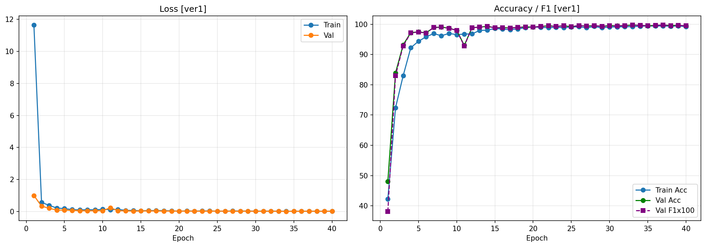
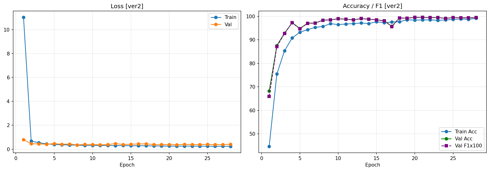
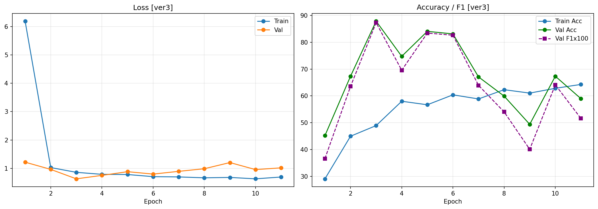
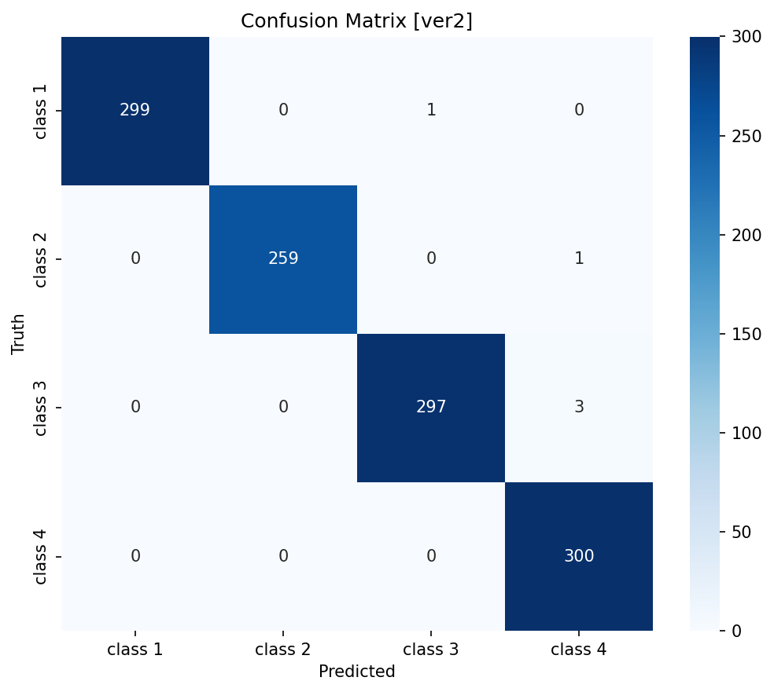
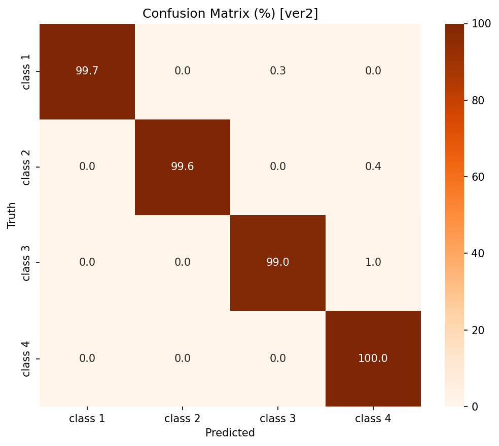

# VGG-16 From Scratch vs Robustness-Aware Image Classification

A VGG-16 (with Batch Normalization) convolutional neural network **built from scratch in PyTorch** to classify grayscale block-pattern images into four classes. The project goes beyond a single training run: it trains **three augmentation variants as a structured ablation study**, then runs a dedicated **test-time robustness experiment** (brightness / contrast / noise perturbations) to decide which model to actually deploy.

> **Framework:** PyTorch (AMP FP16) · **Model:** VGG-16-BN, 134.3M parameters, single-channel input · **Task:** 4-class grayscale classification

---

## Table of Contents

1. [Key Results](#1-key-results)
2. [Repository Structure](#2-repository-structure)
3. [Dataset](#3-dataset)
4. [Preprocessing Pipeline](#4-preprocessing-pipeline)
5. [Network Architecture](#5-network-architecture)
6. [Training Setup](#6-training-setup)
7. [The Three-Version Ablation](#7-the-three-version-ablation)
8. [Full Results & Commentary](#8-full-results--commentary)
9. [Robustness Experiment](#9-robustness-experiment)
10. [CNN Interpretability](#10-cnn-interpretability)
11. [How to Run](#11-how-to-run)
12. [Requirements](#12-requirements)
13. [How to Push This to GitHub](#13-how-to-push-this-to-github)

---

## 1. Key Results

| Metric | Value | Notes |
|---|---|---|
| **Deployed model** | **ver2** (robust augmentation) | Chosen for robustness, not just clean accuracy |
| Clean validation accuracy | **99.57 %** | macro-F1 = **0.9958** |
| Train–val accuracy gap | **0.11 pp** | Negligible → no overfitting |
| Minimum per-class recall | 0.990 (class 4) | All classes > 0.99 precision & recall |
| Robustness to Gaussian noise | **99.31 %** | vs 92.16 % for the clean-only baseline |
| Robustness to darker images | **90.95 %** | vs 83.79 % for the baseline |
| Inference speed | ~3.2 ms / image | RTX 4060 Laptop, AMP FP16 |
| Total parameters | 134,284,228 | 537 MB FP32 / 269 MB FP16 |

**Headline finding:** the version with the *highest clean accuracy* (ver1) was **not** the most robust. ver2 was selected because it survives brightness/noise shifts much better, which matches the test set's known perturbations.

---

## 2. Repository Structure

```
03_VGG16_Robustness/
├── config2.py            # Central config: seeds, paths, classes, hyperparameters, 3 version definitions
├── data_setup2.py        # Step 1 scan folders, stratified train/val split, compute train-only norm stats
├── dataset2.py           # Dataset + DataLoader builders, 3 augmentation levels, custom Gaussian-noise transform
├── model2.py             # SamVGG16Ex2 — VGG-16-BN model definition (single-channel input)
├── trainex2.py           # Step 2 trains all 3 versions, evaluates, plots, picks best → report2.pth
├── robustcheck.py        # Step 3 robustness evaluation under 5 simulated perturbations
├── swap_to_ver2.py       # Step 4 override the auto-selected best model with ver2
├── testrun2.py           # Step 5 inference on the unlabeled test set → clsn2_ans.csv
├── visualize2.py         # CNN interpretability: feature maps, saliency maps, Grad-CAM
├── pipeline2.md          # The 5-command run order
│
├── outputs/              # (generated) all artifacts land here
│   ├── train_split.csv           # 80% training rows (filepath, label, class_name)
│   ├── val_split.csv             # 20% validation rows
│   ├── norm_stats.json           # {"mean": 0.0992, "std": 0.2109}
│   ├── history_ver1.csv          # per-epoch training log for each version
│   ├── history_ver2.csv
│   ├── history_ver3.csv
│   ├── report2_ver1.pth          # best checkpoint per version
│   ├── report2_ver2.pth
│   ├── report2_ver3.pth
│   ├── report2.pth               # the deployed model (= ver2 after swap)
│   ├── version_comparison.csv    # side-by-side metrics table
│   ├── robustness_check.csv      # perturbation accuracy table
│   └── figures/                  # all plots (see below)
│       ├── learning_curves_ver1.png / ver2.png / ver3.png
│       ├── cm_ver1.png / cm_ver1_norm.png / cm_ver2.png / cm_ver2_norm.png ...
│       ├── roc_ver1.png / roc_ver2.png ...
│       ├── per_class_ver1.png / per_class_ver2.png / per_class_ver3.png
│       ├── version_comparison.png
│       ├── feature_maps_per_class.png
│       ├── saliency_maps.png
│       └── grad_cam.png
│
├── clsn2_ans.csv         # (generated) final test-set predictions (filename, prediction)
└── README.md             # this file
```


---

## 3. Dataset

The dataset (`gen_data_exam`) consists of **structured grayscale block patterns** discrete rectangular regions of varying intensity, not photographic scenes. Every image is stored as grayscale, native resolution **240 × 320**, `uint8`, pixel values in `[0, 255]`.

**Training set: 5,800 images across 4 classes**

| Class | Total | Train (80%) | Val (20%) |
|---|---|---|---|
| class 1 | 1,500 | 1,200 | 300 |
| class 2 | **1,300** | 1,040 | 260 |
| class 3 | 1,500 | 1,200 | 300 |
| class 4 | 1,500 | 1,200 | 300 |
| **Total** | **5,800** | 4,640 | 1,160 |

Class 2 is ~13 % smaller than the others. This mild imbalance drove two design choices: **inverse-frequency class weights** in the loss, and a **stratified split** so class 2's proportion is preserved in both partitions.

**Test set:** 400 unlabeled images in `test2/`, same dimensions and color space. Crucially, the test images **intentionally include brightness perturbations and Gaussian noise** while the training images are clean, so **test-time robustness is treated as a primary objective, not an afterthought**.

---

## 4. Preprocessing Pipeline

A five-step pipeline that **cleanly separates training-time augmentation from the clean eval transform** used for validation and inference:

| Step | Operation | Detail |
|---|---|---|
| 1 | **Channel standardization** | `PIL.convert('L')` forces one grayscale channel |
| 2 | **Spatial resize** | 128 × 128 (divisible by 32 = VGG's cumulative stride 2⁵); cuts memory ~84 % vs native, no accuracy loss |
| 3 | **Normalization** | `mean = 0.0992`, `std = 0.2109` computed on the **train split only** to avoid data leakage |
| 4 | **Augmentation** | **Training only.** Val/test use steps 1–3 only (clean). Three augmentation levels defined. |
| 5 | **Deterministic shuffle** | Generator seed = 42, `worker_init_fn` seeded → fully reproducible batch order |

The train-only normalization statistics are saved to `outputs/norm_stats.json` and reused identically across all three training versions and at inference time.

---

## 5. Network Architecture

**VGG-16-BN** the standard 16-layer config (13 conv + 3 FC), with **Batch Normalization after every convolution**.

```
Input 1×128×128 (grayscale)
 → Block 1:  [Conv3×3 ×2] 64,  +BN+ReLU, MaxPool 2×2   → 64×64×64
 → Block 2:  [Conv3×3 ×2] 128, +BN+ReLU, MaxPool 2×2   → 32×32×128
 → Block 3:  [Conv3×3 ×3] 256, +BN+ReLU, MaxPool 2×2   → 16×16×256
 → Block 4:  [Conv3×3 ×3] 512, +BN+ReLU, MaxPool 2×2   → 8×8×512
 → Block 5:  [Conv3×3 ×3] 512, +BN+ReLU, MaxPool 2×2   → 4×4×512
 → AdaptiveAvgPool2d(7×7)                               → 512×7×7
 → Classifier: Linear(25088→4096) → ReLU → Dropout(0.5)
             → Linear(4096→4096)  → ReLU → Dropout(0.5)
             → Linear(4096→4)
```

**Two deliberate adaptations to the standard VGG-16:**

1. **Single input channel** the first conv accepts 1 channel (grayscale) instead of 3. Copying grayscale into three channels would triple the first layer's bandwidth without adding information.
2. **Batch Normalization everywhere** training a 134M-parameter network from *random init* on only 4,640 images causes severe internal covariate shift. BN stabilizes gradient scale and allows a much higher learning rate (`1e-3` instead of `1e-4`).

**Why build from scratch instead of fine-tuning ImageNet weights?** The data is structured grayscale block patterns that differ fundamentally from natural color photos, and from-scratch training lets the first conv layer natively accept one channel without approximation.

**Parameter count:** 134,284,228 total. The first FC layer alone (`Linear(25088→4096)`) accounts for **102.7M params (76.5 %)** characteristic of VGG. Model size: **537 MB FP32 / 269 MB FP16**.

---

## 6. Training Setup

All three versions share the same optimizer, scheduler, and training loop only the augmentation level, LR, weight decay, and optional MixUp differ.

| Hyperparameter | Value |
|---|---|
| Random seed | 42 (fully deterministic) |
| Input size | 128 × 128, 1 channel |
| Physical batch size | 32 |
| Gradient accumulation | 2 steps (effective batch = 64) |
| Max epochs | 40 |
| Early stopping patience | 8 (on validation macro-F1) |
| Optimizer | AdamW |
| LR scheduler | ReduceLROnPlateau (factor = 0.5, patience = 3) |
| Loss | Class-weighted CrossEntropyLoss |
| Dropout | 0.5 (classifier head) |
| Precision | AMP FP16 (`torch.amp.autocast`) |
| Train/val split | 80 / 20, stratified |

**Notes on the choices:**
- **AdamW** applies weight decay directly to weights (cleaner L2 regularization than Adam).
- The scheduler tracks **macro-F1** rather than accuracy, since macro-F1 is more sensitive to a single class starting to plateau under imbalance.
- **Class weights** = reciprocal of each class's train count, normalized so `Σ(weight × count) = num_classes`. Class 2 gets ~15 % higher weight.
- **AMP + gradient accumulation** achieve an effective batch of 64 on an 8-GB laptop GPU while cutting VRAM ~40 %.
- Training history is written to CSV **after every epoch**, so a crash never loses the record.

---

## 7. The Three-Version Ablation

Each version tests a specific hypothesis about which augmentation/regularization best prepares the model for a perturbed test set.

| Configuration | ver1 | ver2 | ver3 |
|---|---|---|---|
| Augmentation level | Geometric only | **Robust** | Robust+ |
| Learning rate | 1.0e-3 | 1.0e-3 | 7.0e-4 |
| Weight decay | 1.0e-4 | 1.0e-4 | 5.0e-4 |
| Label smoothing | 0.00 | 0.05 | 0.10 |
| MixUp | No | No | Yes (α = 0.2) |
| ColorJitter (bright/contrast) | — | ±0.30 | ±0.40 |
| Gaussian noise (std) | — | 0.06 | 0.08 |
| RandomResizedCrop scale | — | 0.80–1.00 | 0.75–1.00 |
| RandomAffine rotation | ±15° | ±15° | ±20° |
| RandomHorizontalFlip | p = 0.5 | p = 0.5 | p = 0.5 |

- **ver1 (baseline):** only geometric augmentation (affine + flip). Confirms VGG-16 can learn the block patterns reliably without photometric augmentation.
- **ver2 (robust):** adds RandomResizedCrop, ColorJitter, custom Gaussian noise, and light label smoothing — directly simulating the brightness/contrast/noise shifts expected in the test set.
- **ver3 (robust+):** pushes all augmentation harder and adds MixUp an intentional stress test of "more regularization = better generalization?"

---

## 8. Full Results & Commentary

### Per-version comparison (clean validation set)

| Metric | ver1 | ver2 | ver3 |
|---|---|---|---|
| Best checkpoint epoch | 37 | 20 | 11 (early-stopped) |
| Total training time | 73m 36s | 47m 56s | 17m 45s |
| Final val accuracy | **99.74 %** | 99.57 % | 87.84 % |
| Val macro-F1 | **0.9975** | 0.9958 | 0.8728 |
| Train–val accuracy gap | 0.13 % | 0.11 % | 0.04 % |
| Min class recall | 0.993 (class 3) | 0.990 (class 4) | **0.583 (class 4)** |
| Inference speed (ms/img) | 4.22 | 3.18 | 3.87 |
| Peak VRAM (MB) | 830.2 | 830.2 | 830.2 |

**Commentary:**
- **ver1** reaches the highest clean macro-F1 (0.9975) but takes the longest to converge (37 epochs).
- **ver2** converges nearly twice as fast (epoch 20) and stays essentially tied on clean accuracy (0.9958). The tiny train–val gap (0.11 pp) shows **no overfitting**.
- **ver3 failed** it early-stopped at epoch 11 with only 0.8728 macro-F1 and a **catastrophic class-4 recall of 0.583**.

### Why ver3 failed as the MixUp / block-pattern incompatibility

MixUp linearly interpolates two images and assigns a convex combination of their labels. For natural images (ImageNet), interpolated samples lie roughly on the data manifold and regularize usefully. For **discrete high-contrast block patterns**, a linear blend of two different-class images resembles *neither* class and lies **off the data manifold**. The network gets contradictory targets and its decision boundary destabilizes — especially for class 4, which shares some block characteristics with class 2.

The per-class evaluation pins the mechanism precisely: **class-4 recall collapsed to 0.583 while its precision stayed at 0.94** i.e. the model stopped predicting class 4 for true class-4 samples (systematic mislabeling), rather than over-predicting it. This confirms a general principle: *augmentation must stay within the distribution of plausible variations; augmentations that move samples off the manifold hurt rather than help.*

### Learning curves

| ver1 | ver2 | ver3 |
|---|---|---|
|  |  |  |
| Smooth convergence to >99 % by epoch 37 | Higher training loss (stronger aug) but val reaches 99.57 % by epoch 20 | Val accuracy oscillates, never passes 87.84 %, early-stops at epoch 11 |

### Confusion matrix & per-class metrics (deployed model, ver2)

| Confusion matrix (ver2) | Normalized (ver2) | Per-class P/R/F1 (ver2) |
|---|---|---|
|  |  |  |

The deployed model achieves **99.57 % accuracy / 0.9958 macro-F1** on the clean validation set. All four classes reach precision and recall above 0.99 (minimum recall 0.990 for class 4). The few misclassified samples are isolated single confusions between adjacent classes, with no systematic pattern. One-vs-Rest ROC AUC values all equal or exceed **0.999**.

---

## 9. Robustness Experiment

The core of the project. After training, each model was evaluated on the validation set under **five simulated test-time perturbations** (using a fixed seed so noise draws are identical across models):

| Perturbation | ver1 | ver2 | ver3 |
|---|---|---|---|
| Clean (no perturbation) | 99.66 % | 99.66 % | 89.57 % |
| Brighter (pixel +0.20) | 25.86 % | 30.60 % | 63.88 % |
| Darker (pixel −0.20) | 83.79 % | **90.95 %** | 61.81 % |
| High contrast (×1.6) | 99.14 % | 99.05 % | 87.67 % |
| Gaussian noise (σ = 0.10) | 92.16 % | **99.31 %** | 95.26 % |
| Combined (brighter + noise) | 25.86 % | 25.95 % | 25.86 % |
| **Worst drop from clean** | 73.80 pp | 73.71 pp | 63.71 pp |

**Commentary:**
- **ver2 clearly beats ver1** where it matters: darker images (90.95 % vs 83.79 %) and Gaussian noise (99.31 % vs 92.16 %) exactly the perturbation types the test set contains.
- Both ver1 and ver2 collapse under large **positive** brightness shifts (+0.20 and the combined case). This is the one weakness that photometric augmentation alone didn't fully solve.
- **ver3**, despite being the most regularized, is worst under brightness changes and MixUp prevented it from learning a sharp enough decision boundary.

**Decision:** the automatic selection (`trainex2.py`) picked **ver1** based on clean F1 alone. Based on the robustness table, this was **manually overridden to ver2** via `swap_to_ver2.py`, since ver2 generalizes better to the perturbations the test set actually carries.

---

## 10. CNN Interpretability

`visualize2.py` produces three interpretability views on the deployed model (one sample per class):

- **Feature maps** (`feature_maps_per_class.png`) mean activation of the block-5 feature map. Classes 2 and 3 show broader activation zones than classes 1 and 4, correlating with their more spatially distributed block layouts.
- **Saliency maps** (`saliency_maps.png`) `|∂score/∂pixel|`, showing which input pixels the class score is most sensitive to. Class 3's sensitivity forms horizontal bands matching its stripe-like structure; class 4's concentrates in isolated bright blocks.
- **Grad-CAM** (`grad_cam.png`) gradient-weighted class activation over the last conv layer. Classes 1 and 4 show localized hot regions (corner / center), while classes 2 and 3 show broader heatmaps — suggesting 2 & 3 need global context while 1 & 4 rely on localized features.

---

## 11. How to Run

Run the scripts **in order** (see `pipeline2.md`). Before running, set the paths in `config2.py` (`BASE_DIR`, `DATA_DIR`) to point at the dataset.

```bash
# 1. Scan folders, stratified 80/20 split, compute train-only norm stats
python data_setup2.py

# 2. Train all 3 versions, evaluate, generate all figures,
#    auto-select best → report2.pth, and run CNN visualizations
python trainex2.py

# 3. Robustness evaluation under 5 perturbation types
python robustcheck.py

# 4. Override the deployed model to ver2 (the robust choice)
python swap_to_ver2.py

# 5. Inference on the unlabeled test set → clsn2_ans.csv
python testrun2.py
```

**Expected data layout** (dataset is *not* included in this repo):

```
<BASE_DIR>/gen_data_exam/
├── train/
│   ├── class 1/   *.png
│   ├── class 2/
│   ├── class 3/
│   └── class 4/
└── test2/          *.png   (unlabeled)
```

`testrun2.py` writes `clsn2_ans.csv` with two columns: `filename`, `prediction`, plus a prediction-distribution summary and inference-speed statistics.

---

